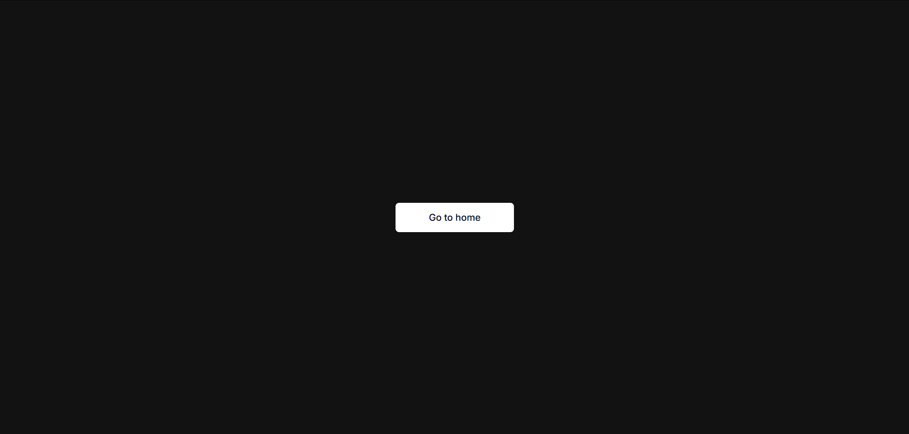
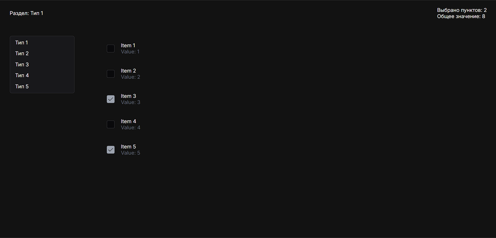

# TestSelectelApp

View project on: https://kneepy.github.io/selectel_test_app

## Development server

To start a local development server, run:

```bash
git clone https://github.com/Kneepy/selectel_test_app.git
npm i
npm run start
```

Once the server is running, open your browser and navigate to `http://localhost:4200/`.

## Building

To build the project run:

```bash
npm run build
```

This will compile your project and store the build artifacts in the `dist/` directory. By default, the production build optimizes your application for performance and speed.

## Review
### Welcome page.
Nothing special, just a button that takes you to the home page.



### Home page.
Here you can navigate through the types of tabs (the menu works like sorting by category, so only the items of the selected category are displayed on the page).


